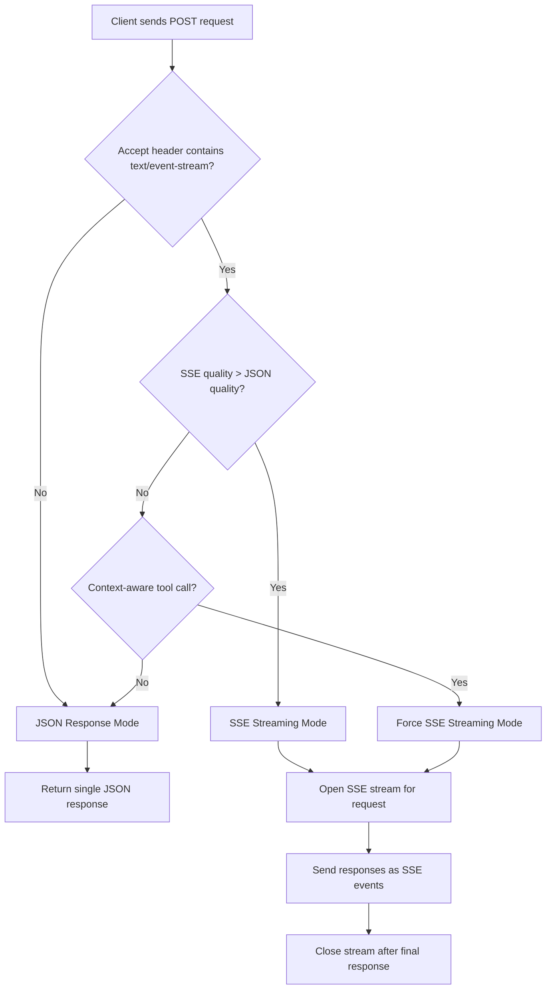
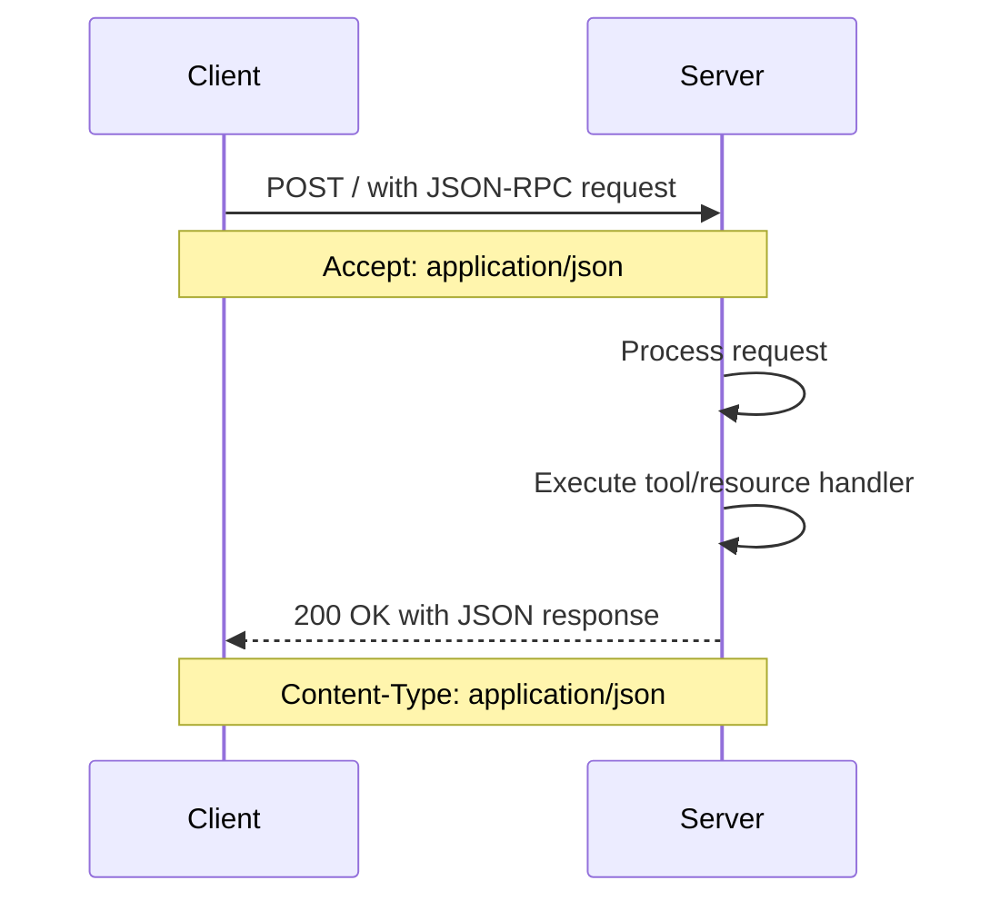
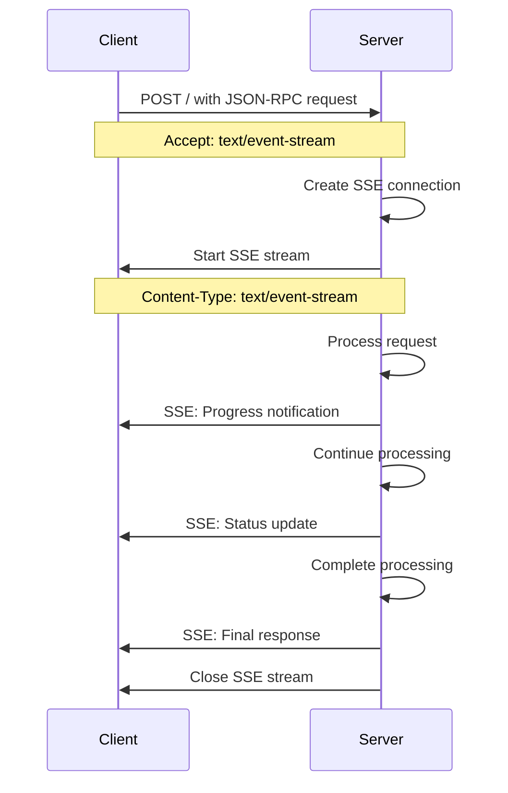
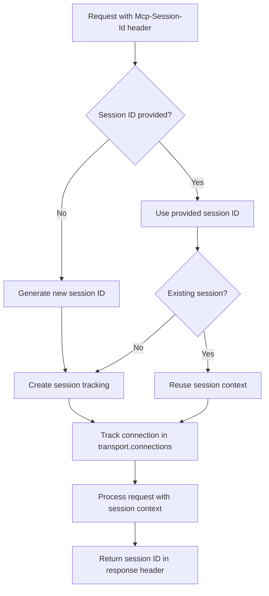
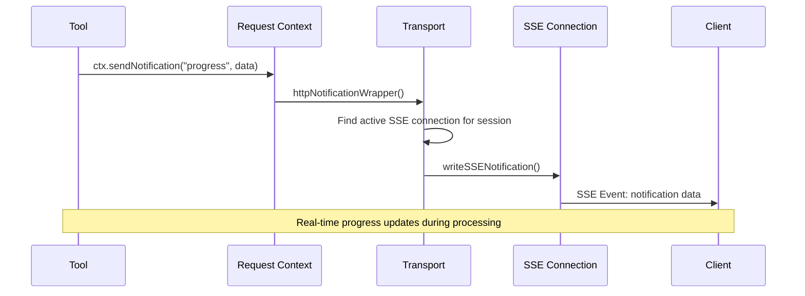

# Streamable HTTP Transport in NimCP

## Overview

NimCP implements the **MCP Streamable HTTP** transport, the preferred transport method for Model Context Protocol servers as of the MCP specification update from 2024-11-05. This transport provides flexible communication between MCP clients and servers using standard HTTP protocols with optional Server-Sent Events (SSE) streaming.

## Architecture

The streamable HTTP transport is built on several key components:

- **`mummy_transport.nim`** - Main transport implementation using the Mummy web framework
- **`http_common.nim`** - Shared utilities for HTTP-based transports
- **`auth.nim`** - Authentication and authorization handling
- **`cors.nim`** - Cross-Origin Resource Sharing support
- **`protocol.nim`** - JSON-RPC 2.0 message handling

## Transport Modes

The transport automatically selects between two response modes based on client capabilities:

### 1. JSON Response Mode (Default)
- Traditional HTTP request-response pattern
- Single JSON response returned immediately
- Used for simple tool calls and resource requests
- Lower latency, stateless communication

### 2. SSE Streaming Mode
- Server-Sent Events for real-time responses
- Enables progress updates and notifications during processing
- Used for long-running operations and context-aware tools
- Per-request streaming (not persistent connections)

## Mode Selection Logic



## Message Flow

### JSON Mode Flow



### SSE Streaming Mode Flow



## Session Management

Sessions provide optional state management and notification routing:



### Session Features

- **Session ID Generation**: Automatic generation for new sessions or manual specification
- **Connection Tracking**: Active SSE connections are tracked per session
- **Notification Routing**: Notifications are sent to specific sessions
- **Automatic Cleanup**: Inactive connections are cleaned up after 30 minutes

## Notification System

For context-aware tools that need to send real-time updates:



### Notification Types

1. **Progress Notifications**: `notifications/progress` with progress, total, and message fields
2. **Logging Notifications**: `notifications/message` with structured log data
3. **Custom Notifications**: Application-specific notification types

## Security Features

### Authentication
- **Bearer Token Validation**: Configurable token-based authentication
- **Custom Error Responses**: Customizable authentication error messages
- **Skip for OPTIONS**: CORS preflight requests bypass authentication

### CORS Protection
```nim
# Default allowed origins for development
@["http://localhost", "https://localhost", "http://127.0.0.1", "https://127.0.0.1"]
```

### DNS Rebinding Protection
- **Origin Header Validation**: Prevents DNS rebinding attacks
- **Configurable Origin Lists**: Whitelist of allowed origins
- **Automatic Validation**: Origin checked on all non-OPTIONS requests

## Implementation Details

### Key Code Patterns

#### Creating a Streamable HTTP Server
```nim
let server = mcpServer("MyServer", "1.0.0"):
  mcpTool:
    proc myTool(param: string): string =
      return "Regular tool result"
  
  mcpTool:
    proc contextTool(ctx: McpRequestContext, param: string): string =
      # Context-aware tool can send notifications
      ctx.sendNotification("progress", %*{"status": "processing"})
      return "Context-aware result"

# Start HTTP transport
server.runHttp(port = 8080)
```

#### Transport Configuration
```nim
let authConfig = newAuthConfig(enabled = true, bearerToken = "secret")
let allowedOrigins = @["https://myapp.com"]
let transport = newMummyTransport(8080, "0.0.0.0", authConfig, allowedOrigins)
transport.serve(server)
```

### Accept Header Parsing

The transport implements sophisticated Accept header parsing with quality values:

```nim
# Example Accept headers and their interpretation:
# "application/json" -> JSON mode
# "text/event-stream" -> SSE mode  
# "application/json, text/event-stream;q=0.8" -> JSON mode (higher default quality)
# "text/event-stream, application/json;q=0.5" -> SSE mode (explicit preference)
```

## Protocol Compliance

NimCP's implementation follows the **MCP 2025-06-18 specification** for streamable HTTP transport:

### Compliance Features

1. **Single Endpoint**: All communication through root path `/`
2. **HTTP Methods**: 
   - `GET /` - Server information and capabilities
   - `POST /` - JSON-RPC requests with automatic mode selection
   - `OPTIONS /` - CORS preflight handling
3. **Content Negotiation**: Accept header-based response format selection
4. **Session Headers**: `Mcp-Session-Id` header support
5. **Error Handling**: Proper JSON-RPC 2.0 error responses
6. **SSE Compliance**: Standard Server-Sent Events with proper event structure

### Specification Adherence

- **UTF-8 Encoding**: All messages are UTF-8 encoded
- **JSON-RPC 2.0**: Strict adherence to JSON-RPC 2.0 message format
- **Stream Lifecycle**: SSE streams are closed after responses per specification
- **Security Recommendations**: Origin validation and authentication support
- **Error Codes**: Standard HTTP status codes and JSON-RPC error codes

## Usage Examples

### Client Request Examples

#### JSON Mode Request
```bash
curl -X POST http://localhost:8080/ \
  -H "Content-Type: application/json" \
  -H "Accept: application/json" \
  -d '{"jsonrpc":"2.0","id":1,"method":"tools/call","params":{"name":"fibonacci","arguments":{"n":5}}}'
```

#### SSE Streaming Request
```bash
curl -X POST http://localhost:8080/ \
  -H "Content-Type: application/json" \
  -H "Accept: text/event-stream" \
  -d '{"jsonrpc":"2.0","id":1,"method":"tools/call","params":{"name":"longTask","arguments":{"duration":3}}}'
```

#### Server Information
```bash
curl -X GET http://localhost:8080/ \
  -H "Accept: application/json"
```

### Response Examples

#### JSON Response
```json
{
  "jsonrpc": "2.0",
  "id": 1,
  "result": {
    "content": [
      {
        "type": "text",
        "text": "Fibonacci(5): [0, 1, 1, 2, 3]"
      }
    ]
  }
}
```

#### SSE Stream Events
```
event: message
data: {"jsonrpc":"2.0","method":"notifications/progress","params":{"progress":1,"total":3,"message":"Step 1 complete"}}

event: message  
data: {"jsonrpc":"2.0","id":1,"result":{"content":[{"type":"text","text":"Long task completed"}]}}
```

## Performance Characteristics

- **Connection Pooling**: Efficient connection reuse for JSON mode
- **On-Demand SSE**: SSE streams created only when needed
- **Memory Management**: Automatic cleanup of inactive connections
- **Concurrent Handling**: Thread-safe request processing
- **Low Latency**: Direct JSON responses for simple operations

## Best Practices

1. **Use JSON Mode** for simple, stateless operations
2. **Use SSE Streaming** for long-running tasks or when progress updates are needed
3. **Implement Context-Aware Tools** for operations requiring real-time feedback
4. **Configure Authentication** for production deployments
5. **Set Appropriate CORS** origins for web-based clients
6. **Monitor Connection Cleanup** to prevent resource leaks